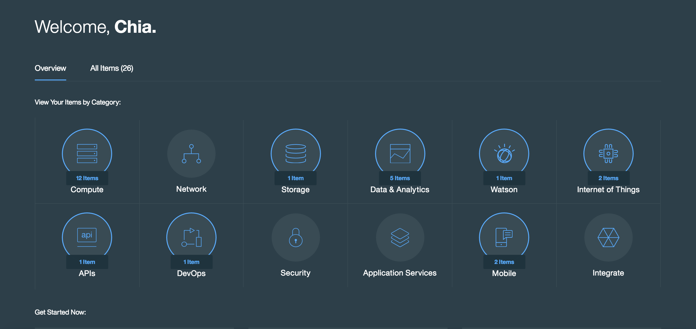
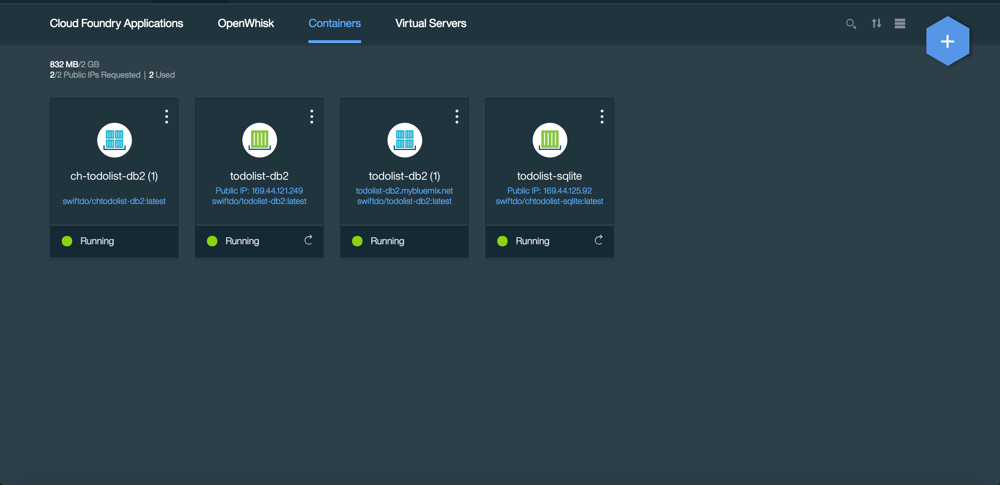
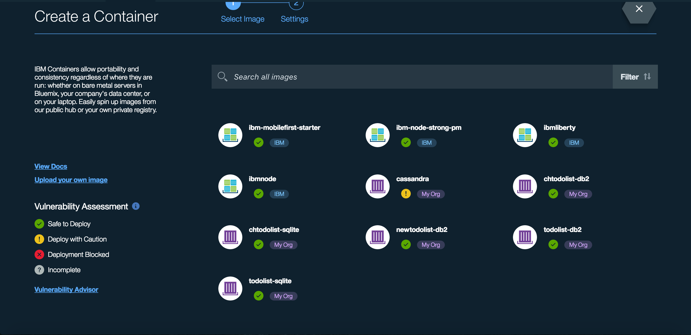
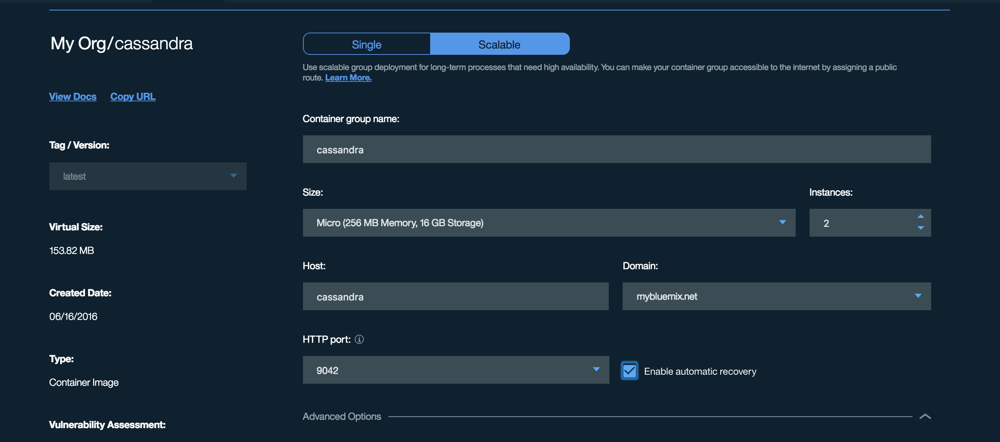

# Kassandra
A Swift Cassandra driver

[](https://travis-ci.com/IBM-Swift/Kassandra) [](https://swift.org/download/#snapshots)


## Quick start:

1. Download the [Swift DEVELOPMENT 08-04 snapshot](https://swift.org/download/#snapshots)

2. Download Cassandra, Python, and pip
  You can use `brew install postgresql python` and `easy_install pip`

3. Install Cqlsh
  You can use `pip install cqlsh`

4. Clone the Kassandra repository
  `git clone https://github.com/IBM-Swift/Kassandra`

5. Compile the library with `swift build -Xcc -I/usr/local/opt/openssl/include -Xlinker -L/usr/local/opt/opensll/lib` or create an XCode project with `swift package generate-xcodeproj`

6. Run the test cases with `swift test -Xcc -I/usr/local/opt/openssl/include -Xlinker -L/usr/local/opt/opensll/lib` or directly from XCode

## Getting an Docker Image from DockerHub

1. Download [Docker Toolbox](https://www.docker.com/products/docker-toolbox)

2. Go pull [Cassandra from DockerHub](https://hub.docker.com/r/library/cassandra/) or you can you this command `docker pull cassandra`

## Deploying Docker to IBM Bluemix Container

1. Login to your [Bluemix](https://new-console.ng.bluemix.net/?direct=classic) account (create an account, if necessary) 

2. Download and install the [Cloud Foundry tools](https://new-console.ng.bluemix.net/docs/starters/install_cli.html):
```
cf login
bluemix api https://api.ng.bluemix.net
bluemix login -u username -o org_name -s space_name
```

3. Download and install the [IBM Container's Plugin] (https://console.ng.bluemix.net/docs/containers/container_cli_cfic_install.html)

4. Log into cf ic
  `cf ic login` 

5. Tag the Docker image:

  `docker tag cassandra registry.ng.bluemix.net/<ORGANIZATION_NAME>/cassandra`

6. Push the Docker image: 

  `docker push registry.ng.bluemix.net/<ORGANIZATION_NAME>/cassandra`

7. Go to Bluemix and look for Compute 

    

8. Search for the '+' sign on the top right corner 

    

9. Then look for the 'cassandra' container that you pushed

    

10. Input the value suggested in the images. Do not require advanced options unless you have any

    

11. Create the container and you should see your container on the dashboard page


